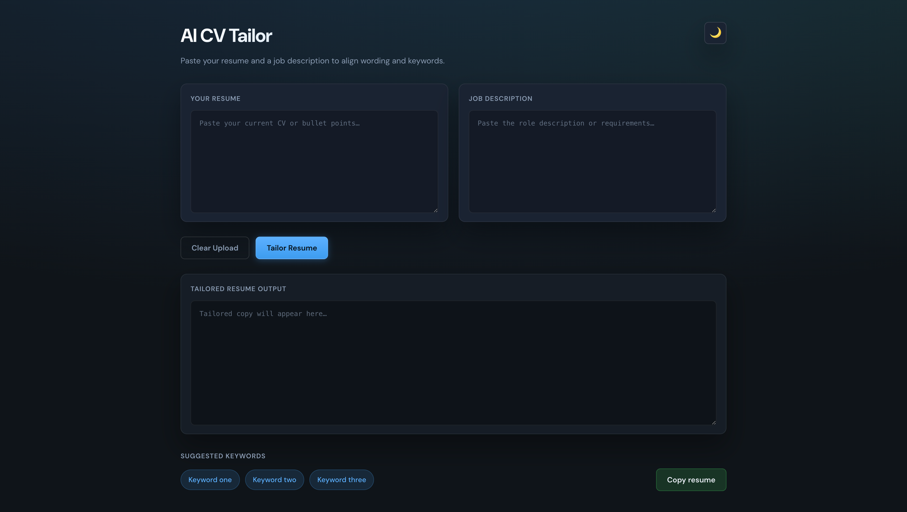
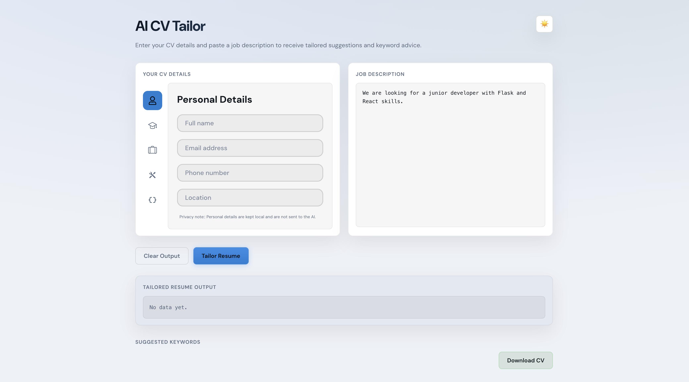

# AI CV Tailor

### DarkMode


### LightMode


## How to run

1. Install dependencies (once):

```bash
npm install
```

2. Start the dev server:

```bash
npm run dev
```

Open the URL printed in the terminal (usually `http://localhost:5173`)..

---

**Production build** (optional):

```bash
npm run build
npm run preview
```

Requires [Node.js](https://nodejs.org/) 18 or newer.
